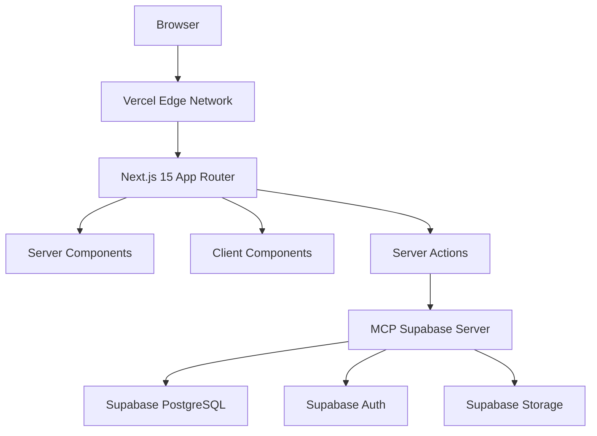

# Design Document

## Overview

Expense Tracker - это современное веб-приложение для управления личными расходами, построенное с использованием актуальных технологий лета 2025 года. Приложение использует Next.js 15 с App Router, Supabase для backend-сервисов и развертывается на Vercel.

### Ключевые принципы архитектуры:
- **Server-First подход** с использованием Server Components и Server Actions
- **MCP-интеграция** для всех внешних сервисов
- **Type-safe разработка** с TypeScript
- **Progressive Enhancement** для оптимальной производительности

## Architecture

### Общая архитектура системы



### Технологический стек:
- **Frontend**: Next.js 15 (App Router, Server Components, Server Actions)
- **Backend**: Supabase (PostgreSQL, Auth, Storage)
- **Deployment**: Vercel
- **Integration**: MCP Supabase Server
- **Styling**: Tailwind CSS
- **Type Safety**: TypeScript
- **State Management**: React Server Components + URL state

## Components and Interfaces

### Структура проекта

```
expense-tracker/
├── app/                          # Next.js App Router
│   ├── (auth)/                   # Auth route group
│   │   ├── login/
│   │   └── signup/
│   ├── (dashboard)/              # Protected routes
│   │   ├── dashboard/
│   │   ├── expenses/
│   │   ├── categories/
│   │   └── analytics/
│   ├── auth/
│   │   └── confirm/              # Email confirmation
│   ├── api/                      # API routes (if needed)
│   ├── globals.css
│   ├── layout.tsx
│   └── page.tsx
├── components/                   # Reusable components
│   ├── ui/                       # Base UI components
│   ├── forms/                    # Form components
│   ├── expense-input/            # Expense input methods
│   │   ├── single-expense/       # Single expense form
│   │   ├── bulk-input/           # Bulk expense input
│   │   ├── bank-upload/          # Bank statement upload
│   │   └── table-input/          # Table-based input
│   ├── categorization/           # Auto-categorization components
│   │   ├── uncategorized-list/   # List of uncategorized expenses
│   │   ├── keyword-assignment/   # Keyword to category assignment
│   │   ├── keyword-manager/      # Manage category keywords
│   │   └── category-suggestions/ # Smart category suggestions
│   ├── charts/                   # Analytics components
│   └── layout/                   # Layout components
├── lib/                          # Utilities and configurations
│   ├── supabase/                 # Supabase clients
│   ├── actions/                  # Server Actions
│   ├── validations/              # Zod schemas
│   └── utils.ts
├── types/                        # TypeScript definitions
└── middleware.ts                 # Auth middleware
```

### Ключевые компоненты

#### 1. Authentication System
- **Server-Side Auth** с использованием `@supabase/ssr`
- **Middleware** для обновления токенов
- **Route Protection** через Server Components

#### 2. Expense Management
- **ExpenseForm** - форма добавления/редактирования одиночных расходов
- **BulkExpenseInput** - компонент для массового ввода расходов
  - **BankStatementUpload** - загрузка и парсинг банковских выписок
  - **ExpenseTable** - табличный ввод множественных расходов
- **ExpenseList** - список расходов с фильтрацией
- **ExpenseCard** - карточка отдельного расхода
- **InputMethodSelector** - выбор способа ввода трат

#### 3. Category Management
- **CategoryManager** - управление категориями
- **CategorySelector** - выбор категории в формах
- **KeywordManager** - управление ключевыми словами для категорий
- **UncategorizedExpenses** - список неопознанных трат
- **KeywordAssignment** - присвоение категорий новым ключевым словам
- **AutoCategorizationEngine** - движок автоматической категоризации

#### 4. Analytics Dashboard
- **ExpenseChart** - графики трат
- **StatsSummary** - сводная статистика
- **TrendAnalysis** - анализ трендов

### Методы ввода расходов

#### 1. Одиночный ввод (Single Entry)
- **Стандартная форма** для добавления одного расхода
- **Быстрый ввод** с автозаполнением категорий
- **Валидация в реальном времени**

#### 2. Массовый табличный ввод (Bulk Table Input)
- **Интерактивная таблица** для ввода множественных расходов
- **Копирование из Excel/Google Sheets**
- **Inline редактирование** с валидацией
- **Предварительный просмотр** перед сохранением

#### 3. Загрузка банковских выписок (Bank Statement Upload)
- **Поддержка форматов**: CSV, XLSX, OFX
- **Автоматический парсинг** банковских данных
- **Сопоставление колонок** с полями системы
- **Дедупликация** существующих записей
- **Массовое назначение категорий** с ML-предложениями

### Система автоматической категоризации

#### 1. Ключевые слова категорий
- **Управление ключевыми словами** для каждой категории
- **Оценка уверенности** (confidence score) для каждого ключевого слова
- **Автоматическое извлечение** ключевых слов из описаний трат

#### 2. Процесс категоризации
- **Анализ описания** траты на наличие ключевых слов
- **Автоматическое назначение** категории при совпадении
- **Статус "неопознанная"** для трат без совпадений

#### 3. Управление неопознанными тратами
- **Список неопознанных трат** с предложениями категорий
- **Быстрое назначение** категорий новым ключевым словам
- **Создание новых категорий** прямо из интерфейса неопознанных трат
- **Автоматическая перекатегоризация** при добавлении новых ключевых слов

#### 4. Интеллектуальные предложения
- **Анализ частоты** неопознанных ключевых слов
- **Предложения категорий** на основе похожих трат
- **Обучение системы** на основе пользовательских решений

## Data Models

### Database Schema

```sql
-- Пользователи (управляется Supabase Auth)
-- auth.users table уже существует

-- Категории расходов
CREATE TABLE categories (
  id UUID DEFAULT gen_random_uuid() PRIMARY KEY,
  user_id UUID REFERENCES auth.users(id) ON DELETE CASCADE,
  name VARCHAR(100) NOT NULL,
  color VARCHAR(7) DEFAULT '#6366f1', -- hex color
  icon VARCHAR(50) DEFAULT 'shopping-bag',
  created_at TIMESTAMP WITH TIME ZONE DEFAULT NOW(),
  updated_at TIMESTAMP WITH TIME ZONE DEFAULT NOW(),
  
  UNIQUE(user_id, name)
);

-- Ключевые слова для автоматической категоризации
CREATE TABLE category_keywords (
  id UUID DEFAULT gen_random_uuid() PRIMARY KEY,
  user_id UUID REFERENCES auth.users(id) ON DELETE CASCADE,
  category_id UUID REFERENCES categories(id) ON DELETE CASCADE,
  keyword VARCHAR(100) NOT NULL,
  confidence_score DECIMAL(3,2) DEFAULT 1.0 CHECK (confidence_score >= 0 AND confidence_score <= 1),
  created_at TIMESTAMP WITH TIME ZONE DEFAULT NOW(),
  
  UNIQUE(user_id, keyword)
);

-- Расходы
CREATE TABLE expenses (
  id UUID DEFAULT gen_random_uuid() PRIMARY KEY,
  user_id UUID REFERENCES auth.users(id) ON DELETE CASCADE,
  category_id UUID REFERENCES categories(id) ON DELETE SET NULL,
  amount DECIMAL(12,2) NOT NULL CHECK (amount > 0),
  description TEXT,
  expense_date DATE NOT NULL DEFAULT CURRENT_DATE,
  input_method VARCHAR(20) DEFAULT 'single' CHECK (input_method IN ('single', 'bulk_table', 'bank_statement')),
  batch_id UUID, -- для группировки массовых операций
  original_data JSONB, -- оригинальные данные из банковской выписки
  status VARCHAR(20) DEFAULT 'categorized' CHECK (status IN ('categorized', 'uncategorized', 'pending_review')),
  matched_keywords TEXT[], -- ключевые слова, по которым была определена категория
  auto_categorized BOOLEAN DEFAULT FALSE, -- была ли категория назначена автоматически
  created_at TIMESTAMP WITH TIME ZONE DEFAULT NOW(),
  updated_at TIMESTAMP WITH TIME ZONE DEFAULT NOW()
);

-- Неопознанные ключевые слова для ручной категоризации
CREATE TABLE unrecognized_keywords (
  id UUID DEFAULT gen_random_uuid() PRIMARY KEY,
  user_id UUID REFERENCES auth.users(id) ON DELETE CASCADE,
  keyword VARCHAR(100) NOT NULL,
  frequency INTEGER DEFAULT 1, -- сколько раз встречалось
  first_seen TIMESTAMP WITH TIME ZONE DEFAULT NOW(),
  last_seen TIMESTAMP WITH TIME ZONE DEFAULT NOW(),
  
  UNIQUE(user_id, keyword)
);

-- Таблица для хранения загруженных файлов банковских выписок
CREATE TABLE bank_statements (
  id UUID DEFAULT gen_random_uuid() PRIMARY KEY,
  user_id UUID REFERENCES auth.users(id) ON DELETE CASCADE,
  filename VARCHAR(255) NOT NULL,
  file_type VARCHAR(10) NOT NULL CHECK (file_type IN ('csv', 'xlsx', 'ofx')),
  upload_date TIMESTAMP WITH TIME ZONE DEFAULT NOW(),
  processed_at TIMESTAMP WITH TIME ZONE,
  status VARCHAR(20) DEFAULT 'pending' CHECK (status IN ('pending', 'processing', 'completed', 'failed')),
  total_records INTEGER DEFAULT 0,
  processed_records INTEGER DEFAULT 0,
  error_message TEXT
);

-- Индексы для производительности
CREATE INDEX idx_expenses_user_id ON expenses(user_id);
CREATE INDEX idx_expenses_category_id ON expenses(category_id);
CREATE INDEX idx_expenses_date ON expenses(expense_date);
CREATE INDEX idx_expenses_user_date ON expenses(user_id, expense_date DESC);
CREATE INDEX idx_expenses_batch_id ON expenses(batch_id);
CREATE INDEX idx_expenses_input_method ON expenses(input_method);
CREATE INDEX idx_expenses_status ON expenses(status);
CREATE INDEX idx_expenses_user_status ON expenses(user_id, status);
CREATE INDEX idx_bank_statements_user_id ON bank_statements(user_id);
CREATE INDEX idx_bank_statements_status ON bank_statements(status);
CREATE INDEX idx_category_keywords_user_id ON category_keywords(user_id);
CREATE INDEX idx_category_keywords_category_id ON category_keywords(category_id);
CREATE INDEX idx_category_keywords_keyword ON category_keywords(keyword);
CREATE INDEX idx_unrecognized_keywords_user_id ON unrecognized_keywords(user_id);
CREATE INDEX idx_unrecognized_keywords_frequency ON unrecognized_keywords(frequency DESC);

-- RLS (Row Level Security) политики
ALTER TABLE categories ENABLE ROW LEVEL SECURITY;
ALTER TABLE expenses ENABLE ROW LEVEL SECURITY;
ALTER TABLE bank_statements ENABLE ROW LEVEL SECURITY;
ALTER TABLE category_keywords ENABLE ROW LEVEL SECURITY;
ALTER TABLE unrecognized_keywords ENABLE ROW LEVEL SECURITY;

-- Политики для categories
CREATE POLICY "Users can view own categories" ON categories
  FOR SELECT USING (auth.uid() = user_id);

CREATE POLICY "Users can insert own categories" ON categories
  FOR INSERT WITH CHECK (auth.uid() = user_id);

CREATE POLICY "Users can update own categories" ON categories
  FOR UPDATE USING (auth.uid() = user_id);

CREATE POLICY "Users can delete own categories" ON categories
  FOR DELETE USING (auth.uid() = user_id);

-- Политики для expenses
CREATE POLICY "Users can view own expenses" ON expenses
  FOR SELECT USING (auth.uid() = user_id);

CREATE POLICY "Users can insert own expenses" ON expenses
  FOR INSERT WITH CHECK (auth.uid() = user_id);

CREATE POLICY "Users can update own expenses" ON expenses
  FOR UPDATE USING (auth.uid() = user_id);

CREATE POLICY "Users can delete own expenses" ON expenses
  FOR DELETE USING (auth.uid() = user_id);

-- Политики для bank_statements
CREATE POLICY "Users can view own bank statements" ON bank_statements
  FOR SELECT USING (auth.uid() = user_id);

CREATE POLICY "Users can insert own bank statements" ON bank_statements
  FOR INSERT WITH CHECK (auth.uid() = user_id);

CREATE POLICY "Users can update own bank statements" ON bank_statements
  FOR UPDATE USING (auth.uid() = user_id);

CREATE POLICY "Users can delete own bank statements" ON bank_statements
  FOR DELETE USING (auth.uid() = user_id);

-- Политики для category_keywords
CREATE POLICY "Users can view own category keywords" ON category_keywords
  FOR SELECT USING (auth.uid() = user_id);

CREATE POLICY "Users can insert own category keywords" ON category_keywords
  FOR INSERT WITH CHECK (auth.uid() = user_id);

CREATE POLICY "Users can update own category keywords" ON category_keywords
  FOR UPDATE USING (auth.uid() = user_id);

CREATE POLICY "Users can delete own category keywords" ON category_keywords
  FOR DELETE USING (auth.uid() = user_id);

-- Политики для unrecognized_keywords
CREATE POLICY "Users can view own unrecognized keywords" ON unrecognized_keywords
  FOR SELECT USING (auth.uid() = user_id);

CREATE POLICY "Users can insert own unrecognized keywords" ON unrecognized_keywords
  FOR INSERT WITH CHECK (auth.uid() = user_id);

CREATE POLICY "Users can update own unrecognized keywords" ON unrecognized_keywords
  FOR UPDATE USING (auth.uid() = user_id);

CREATE POLICY "Users can delete own unrecognized keywords" ON unrecognized_keywords
  FOR DELETE USING (auth.uid() = user_id);
```
#
## TypeScript Types

```typescript
// Database types (generated by Supabase)
export interface Database {
  public: {
    Tables: {
      categories: {
        Row: {
          id: string
          user_id: string
          name: string
          color: string
          icon: string
          created_at: string
          updated_at: string
        }
        Insert: {
          id?: string
          user_id: string
          name: string
          color?: string
          icon?: string
          created_at?: string
          updated_at?: string
        }
        Update: {
          id?: string
          user_id?: string
          name?: string
          color?: string
          icon?: string
          created_at?: string
          updated_at?: string
        }
      }
      expenses: {
        Row: {
          id: string
          user_id: string
          category_id: string | null
          amount: number
          description: string | null
          expense_date: string
          input_method: 'single' | 'bulk_table' | 'bank_statement'
          batch_id: string | null
          original_data: any | null
          status: 'categorized' | 'uncategorized' | 'pending_review'
          matched_keywords: string[] | null
          auto_categorized: boolean
          created_at: string
          updated_at: string
        }
        Insert: {
          id?: string
          user_id: string
          category_id?: string | null
          amount: number
          description?: string | null
          expense_date?: string
          input_method?: 'single' | 'bulk_table' | 'bank_statement'
          batch_id?: string | null
          original_data?: any | null
          status?: 'categorized' | 'uncategorized' | 'pending_review'
          matched_keywords?: string[] | null
          auto_categorized?: boolean
          created_at?: string
          updated_at?: string
        }
        Update: {
          id?: string
          user_id?: string
          category_id?: string | null
          amount?: number
          description?: string | null
          expense_date?: string
          input_method?: 'single' | 'bulk_table' | 'bank_statement'
          batch_id?: string | null
          original_data?: any | null
          status?: 'categorized' | 'uncategorized' | 'pending_review'
          matched_keywords?: string[] | null
          auto_categorized?: boolean
          created_at?: string
          updated_at?: string
        }
      }
      bank_statements: {
        Row: {
          id: string
          user_id: string
          filename: string
          file_type: 'csv' | 'xlsx' | 'ofx'
          upload_date: string
          processed_at: string | null
          status: 'pending' | 'processing' | 'completed' | 'failed'
          total_records: number
          processed_records: number
          error_message: string | null
        }
        Insert: {
          id?: string
          user_id: string
          filename: string
          file_type: 'csv' | 'xlsx' | 'ofx'
          upload_date?: string
          processed_at?: string | null
          status?: 'pending' | 'processing' | 'completed' | 'failed'
          total_records?: number
          processed_records?: number
          error_message?: string | null
        }
        Update: {
          id?: string
          user_id?: string
          filename?: string
          file_type?: 'csv' | 'xlsx' | 'ofx'
          upload_date?: string
          processed_at?: string | null
          status?: 'pending' | 'processing' | 'completed' | 'failed'
          total_records?: number
          processed_records?: number
          error_message?: string | null
        }
      }
      category_keywords: {
        Row: {
          id: string
          user_id: string
          category_id: string
          keyword: string
          confidence_score: number
          created_at: string
        }
        Insert: {
          id?: string
          user_id: string
          category_id: string
          keyword: string
          confidence_score?: number
          created_at?: string
        }
        Update: {
          id?: string
          user_id?: string
          category_id?: string
          keyword?: string
          confidence_score?: number
          created_at?: string
        }
      }
      unrecognized_keywords: {
        Row: {
          id: string
          user_id: string
          keyword: string
          frequency: number
          first_seen: string
          last_seen: string
        }
        Insert: {
          id?: string
          user_id: string
          keyword: string
          frequency?: number
          first_seen?: string
          last_seen?: string
        }
        Update: {
          id?: string
          user_id?: string
          keyword?: string
          frequency?: number
          first_seen?: string
          last_seen?: string
        }
      }
    }
  }
}

// Application types
export type Category = Database['public']['Tables']['categories']['Row']
export type Expense = Database['public']['Tables']['expenses']['Row'] & {
  category?: Category | null
}
export type BankStatement = Database['public']['Tables']['bank_statements']['Row']
export type CategoryKeyword = Database['public']['Tables']['category_keywords']['Row']
export type UnrecognizedKeyword = Database['public']['Tables']['unrecognized_keywords']['Row']

export type ExpenseWithCategory = Expense & {
  category: Category
}

export type CategoryWithKeywords = Category & {
  keywords: CategoryKeyword[]
}

// Form types
export type CreateExpenseData = {
  amount: number
  description?: string
  category_id: string
  expense_date: string
  input_method?: 'single' | 'bulk_table' | 'bank_statement'
  batch_id?: string
}

export type CreateCategoryData = {
  name: string
  color?: string
  icon?: string
}

// Bulk input types
export type BulkExpenseRow = {
  amount: number
  description?: string
  category_id: string
  expense_date: string
  tempId?: string // для отслеживания в UI
}

export type BankStatementRow = {
  date: string
  amount: number
  description: string
  balance?: number
  originalData: Record<string, any>
}

export type ExpenseInputMethod = 'single' | 'bulk_table' | 'bank_statement'

export type BulkImportResult = {
  success: number
  failed: number
  uncategorized: number
  errors: Array<{
    row: number
    message: string
  }>
}

// Auto-categorization types
export type KeywordMatch = {
  keyword: string
  category_id: string
  confidence_score: number
}

export type CategorizationResult = {
  category_id: string | null
  matched_keywords: string[]
  confidence: number
  auto_categorized: boolean
}

export type UncategorizedExpenseWithKeywords = Expense & {
  suggested_keywords: string[]
  potential_categories: Array<{
    category: Category
    confidence: number
    matched_keywords: string[]
  }>
}
```

## Error Handling

### Стратегия обработки ошибок

1. **Server Actions Error Handling**
```typescript
// Одиночный расход
export async function createExpense(data: CreateExpenseData) {
  try {
    const supabase = createServerClient()
    const { data: expense, error } = await supabase
      .from('expenses')
      .insert({ ...data, input_method: 'single' })
      .select()
      .single()
    
    if (error) {
      return { error: error.message }
    }
    
    revalidatePath('/expenses')
    return { data: expense }
  } catch (error) {
    return { error: 'Unexpected error occurred' }
  }
}

// Массовый ввод
export async function createBulkExpenses(expenses: BulkExpenseRow[]) {
  try {
    const supabase = createServerClient()
    const batchId = crypto.randomUUID()
    
    const expensesWithBatch = expenses.map(expense => ({
      ...expense,
      input_method: 'bulk_table' as const,
      batch_id: batchId
    }))
    
    const { data, error } = await supabase
      .from('expenses')
      .insert(expensesWithBatch)
      .select()
    
    if (error) {
      return { error: error.message }
    }
    
    revalidatePath('/expenses')
    return { data, batchId }
  } catch (error) {
    return { error: 'Unexpected error occurred' }
  }
}

// Обработка банковской выписки
export async function processBankStatement(
  statementId: string, 
  mappedData: BankStatementRow[]
) {
  try {
    const supabase = createServerClient()
    const batchId = crypto.randomUUID()
    
    // Обновляем статус выписки
    await supabase
      .from('bank_statements')
      .update({ status: 'processing' })
      .eq('id', statementId)
    
    const expenses = mappedData.map(row => ({
      amount: Math.abs(row.amount), // банковские данные могут быть отрицательными
      description: row.description,
      expense_date: row.date,
      input_method: 'bank_statement' as const,
      batch_id: batchId,
      original_data: row.originalData,
      category_id: null // будет назначена позже
    }))
    
    const { data, error } = await supabase
      .from('expenses')
      .insert(expenses)
      .select()
    
    if (error) {
      await supabase
        .from('bank_statements')
        .update({ 
          status: 'failed', 
          error_message: error.message 
        })
        .eq('id', statementId)
      return { error: error.message }
    }
    
    // Обновляем статус выписки
    await supabase
      .from('bank_statements')
      .update({ 
        status: 'completed',
        processed_at: new Date().toISOString(),
        processed_records: data.length
      })
      .eq('id', statementId)
    
    revalidatePath('/expenses')
    return { data, batchId }
  } catch (error) {
    return { error: 'Unexpected error occurred' }
  }
}

// Автоматическая категоризация
export async function categorizeExpense(description: string): Promise<CategorizationResult> {
  try {
    const supabase = createServerClient()
    
    // Получаем все ключевые слова пользователя
    const { data: keywords } = await supabase
      .from('category_keywords')
      .select('keyword, category_id, confidence_score')
      .order('confidence_score', { ascending: false })
    
    if (!keywords) {
      return {
        category_id: null,
        matched_keywords: [],
        confidence: 0,
        auto_categorized: false
      }
    }
    
    const descriptionLower = description.toLowerCase()
    const matches: KeywordMatch[] = []
    
    // Ищем совпадения ключевых слов
    for (const keyword of keywords) {
      if (descriptionLower.includes(keyword.keyword.toLowerCase())) {
        matches.push(keyword)
      }
    }
    
    if (matches.length === 0) {
      // Сохраняем неопознанные ключевые слова
      await saveUnrecognizedKeywords(description)
      return {
        category_id: null,
        matched_keywords: [],
        confidence: 0,
        auto_categorized: false
      }
    }
    
    // Выбираем категорию с наивысшим confidence score
    const bestMatch = matches[0]
    
    return {
      category_id: bestMatch.category_id,
      matched_keywords: matches.map(m => m.keyword),
      confidence: bestMatch.confidence_score,
      auto_categorized: true
    }
  } catch (error) {
    return {
      category_id: null,
      matched_keywords: [],
      confidence: 0,
      auto_categorized: false
    }
  }
}

// Сохранение неопознанных ключевых слов
async function saveUnrecognizedKeywords(description: string) {
  const supabase = createServerClient()
  
  // Простое извлечение ключевых слов (можно улучшить с помощью NLP)
  const words = description.toLowerCase()
    .replace(/[^\w\s]/g, '')
    .split(/\s+/)
    .filter(word => word.length > 2)
  
  for (const word of words) {
    await supabase
      .from('unrecognized_keywords')
      .upsert({
        keyword: word,
        frequency: 1,
        last_seen: new Date().toISOString()
      }, {
        onConflict: 'user_id,keyword',
        ignoreDuplicates: false
      })
      .select()
      .then(({ data }) => {
        if (data && data[0]) {
          // Увеличиваем частоту если ключевое слово уже существует
          supabase
            .from('unrecognized_keywords')
            .update({
              frequency: data[0].frequency + 1,
              last_seen: new Date().toISOString()
            })
            .eq('id', data[0].id)
        }
      })
  }
}

// Назначение категории ключевому слову
export async function assignCategoryToKeyword(
  keyword: string, 
  categoryId: string,
  confidenceScore: number = 1.0
) {
  try {
    const supabase = createServerClient()
    
    // Добавляем ключевое слово к категории
    const { error: keywordError } = await supabase
      .from('category_keywords')
      .insert({
        keyword,
        category_id: categoryId,
        confidence_score: confidenceScore
      })
    
    if (keywordError) {
      return { error: keywordError.message }
    }
    
    // Удаляем из неопознанных
    await supabase
      .from('unrecognized_keywords')
      .delete()
      .eq('keyword', keyword)
    
    // Перекатегоризируем все неопознанные траты с этим ключевым словом
    await recategorizeExpensesByKeyword(keyword, categoryId)
    
    revalidatePath('/expenses')
    revalidatePath('/categories')
    
    return { success: true }
  } catch (error) {
    return { error: 'Unexpected error occurred' }
  }
}

// Перекатегоризация трат по новому ключевому слову
async function recategorizeExpensesByKeyword(keyword: string, categoryId: string) {
  const supabase = createServerClient()
  
  // Находим все неопознанные траты, содержащие это ключевое слово
  const { data: expenses } = await supabase
    .from('expenses')
    .select('id, description')
    .eq('status', 'uncategorized')
    .ilike('description', `%${keyword}%`)
  
  if (expenses && expenses.length > 0) {
    const expenseIds = expenses.map(e => e.id)
    
    // Обновляем статус и категорию
    await supabase
      .from('expenses')
      .update({
        category_id: categoryId,
        status: 'categorized',
        auto_categorized: true,
        matched_keywords: [keyword]
      })
      .in('id', expenseIds)
  }
}
```

2. **Client-Side Error Boundaries**
3. **Toast Notifications** для пользовательских ошибок
4. **Fallback UI** для критических ошибок

### Типы ошибок:
- **Validation Errors** - ошибки валидации форм
- **Network Errors** - проблемы с подключением
- **Authentication Errors** - ошибки аутентификации
- **Database Errors** - ошибки базы данных
- **Permission Errors** - ошибки доступа

## Testing Strategy

### Уровни тестирования

1. **Unit Tests** (Jest + Testing Library)
   - Utility functions
   - Form validation
   - Data transformations

2. **Integration Tests**
   - Server Actions
   - Database operations
   - API endpoints

3. **Component Tests**
   - React components
   - User interactions
   - Form submissions

4. **E2E Tests** (Playwright)
   - Critical user flows
   - Authentication flow
   - Expense management flow

### Test Structure
```
__tests__/
├── unit/
│   ├── lib/
│   └── utils/
├── integration/
│   ├── actions/
│   └── api/
├── components/
└── e2e/
    ├── auth.spec.ts
    ├── expenses.spec.ts
    └── analytics.spec.ts
```

## Security Considerations

### Authentication & Authorization
- **Supabase Auth** с email/password
- **Row Level Security (RLS)** для всех таблиц
- **Server-Side Session Management**
- **CSRF Protection** через Server Actions

### Data Protection
- **Input Validation** с Zod schemas
- **SQL Injection Prevention** через Supabase client
- **XSS Protection** через React's built-in escaping
- **Secure Headers** через Next.js middleware

### Privacy
- **Data Isolation** - пользователи видят только свои данные
- **Secure Cookies** для session management
- **HTTPS Only** в production

## Performance Optimization

### Next.js 15 Optimizations
- **Server Components** для статического контента
- **Streaming** для улучшения загрузки
- **Partial Prerendering** где возможно
- **Image Optimization** для графиков и иконок

### Database Optimizations
- **Proper Indexing** для частых запросов
- **Query Optimization** через Supabase
- **Connection Pooling** (встроено в Supabase)

### Caching Strategy
- **Next.js Cache** для статических данных
- **Supabase Cache** для повторяющихся запросов
- **Browser Cache** для статических ресурсов

## Deployment & DevOps

### Git Workflow
- **Feature branches** для новых функций
- **Pull Requests** для code review
- **Automated testing** в CI/CD
- **Semantic versioning** для releases

### Vercel Deployment
- **Automatic deployments** из main branch
- **Preview deployments** для PR
- **Environment variables** для конфигурации
- **Analytics** для мониторинга производительности

### Monitoring
- **Vercel Analytics** для производительности
- **Supabase Dashboard** для database metrics
- **Error tracking** через встроенные инструменты
- **User feedback** через in-app формы